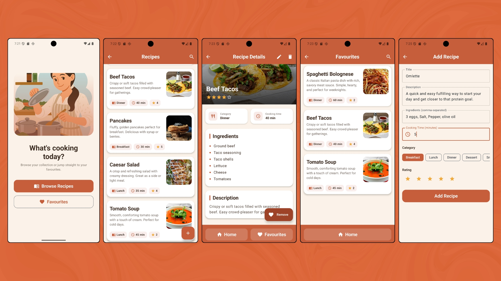

# 🍳 Recipe App

A modern Android recipe application built entirely with **Kotlin** and **Jetpack Compose**, following clean architecture principles and the MVVM pattern. Browse a curated collection of recipes, mark favourites, search, and manage your own recipes with full create/edit/delete support — all backed by a local Room database that works completely offline.

---
## 📸 Screenshots



---
## ✨ Features

- **Browse recipes** — a scrollable list of recipes, each showing its category, cooking time, and star rating at a glance.
- **Recipe details** — a full detail screen with a hero image, ingredients, description, and metadata.
- **Favourites** — tap to favourite/unfavourite any recipe; favourites persist across app launches and have their own dedicated screen.
- **Search** — filter recipes and favourites by title in real time.
- **Full CRUD** — add new recipes, edit existing ones, and delete them (with a confirmation dialog).
- **Categories** — each recipe belongs to one of several predefined categories (Breakfast, Lunch, Dinner, Dessert, Snack).
- **Ratings** — rate recipes from 1 to 5 stars via an interactive star selector.
- **Cooking time** — record and display preparation time per recipe.
- **Offline-first** — all data is stored locally with Room, so the app works with no network connection.
- **Cohesive design** — a custom terracotta + cream visual identity applied consistently across every screen.

---

## 🛠️ Tech Stack

| Technology | Purpose |
| --- | --- |
| **Kotlin** | Primary language |
| **Jetpack Compose** | Declarative UI toolkit |
| **Material 3** | Design system and components |
| **Room** | Local SQLite persistence layer |
| **Hilt** | Dependency injection |
| **Navigation Compose** | In-app navigation between screens |
| **Kotlin Coroutines & Flow** | Asynchronous work and reactive data streams |
| **StateFlow** | Observable UI state |
| **KSP** | Annotation processing (Room & Hilt code generation) |

---

## 🏗️ Architecture

The app follows **MVVM** within a layered **clean architecture**, keeping the UI, business logic, and data concerns separated.

```
UI (Compose) → ViewModel → Repository → DAO → Room Database
```

- **UI layer** — Composable screens that observe state and emit user events. Screens are stateless where possible, with state hoisted to ViewModels.
- **ViewModel** — holds and exposes UI state via `StateFlow`, handles user actions, and survives configuration changes.
- **Repository** — an interface (in the domain layer) with an implementation (in the data layer), acting as the single source of truth and decoupling the ViewModel from Room.
- **Data layer** — Room entities, DAOs, type converters, and the database definition.

Data flows reactively: Room exposes queries as `Flow`, so any change to the database (a new recipe, a toggled favourite) automatically propagates up to the UI without manual refreshing.

### Project structure

```
com.example.recipeapp
├── App                    # MainActivity
├── data
│   ├── local
│   │   ├── dao            # RecipeDao
│   │   ├── entity         # RecipeEntity
│   │   ├── Converters     # Room TypeConverters
│   │   ├── InitialRecipes # Seed data
│   │   └── RecipeDatabase
│   └── repository         # RecipeRepositoryImpl
├── domain
│   ├── model              # Category, domain models
│   └── repository         # RecipeRepository (interface)
├── core
│   └── di                 # Hilt modules (DatabaseModule, RepositoryModule)
├── ui
│   ├── feature
│   │   ├── home
│   │   ├── recipes
│   │   ├── recipeDetails
│   │   ├── favourites
│   │   └── insert         # Add/Edit screen
│   ├── navigation         # NavGraph + Routes
│   └── theme              # Shared colors & theme
└── RecipeApplication      # @HiltAndroidApp entry point
```

---

## 💾 Database

The app uses **Room** with a few notable details:

- The database is **pre-populated** on first launch with a set of starter recipes via a `RoomDatabase.Callback`.
- A `TypeConverter` handles persisting non-primitive fields (the ingredients `List<String>` and the `Category` enum), which SQLite can't store directly.
- The database is provided as a **singleton** through Hilt, ensuring a single instance for the app's lifetime.
- Schema changes are handled with `fallbackToDestructiveMigration` during development.

---

## 🚀 Getting Started

### Prerequisites

- Android Studio (latest stable recommended)
- JDK 17
- An Android emulator or physical device running **API 24+**

### Setup

1. Clone the repository:
   ```bash
   git clone https://github.com/badroben/RecipeApp.git
   ```
2. Open the project in Android Studio.
3. Let Gradle sync and download dependencies.
4. Run the app on an emulator or device.

On first launch, the database seeds itself with the starter recipes automatically — no extra setup needed.

---

## 📦 Build Configuration

Dependencies are managed via a **version catalog** (`gradle/libs.versions.toml`) for centralized version control. Key tooling:

- Android Gradle Plugin 8.7.3
- Kotlin 2.2.10
- KSP for annotation processing (replacing the older kapt)
- Java 17 compatibility

---

## 🗺️ Possible Future Improvements

- User-selectable recipe images (currently uses bundled drawables)
- Filtering and sorting by category, rating, or cooking time
- Proper Room migrations (instead of destructive fallback) for production data safety
- Unit and UI tests for the ViewModel and data layers
- Dark mode support

---

## 📄 License

This project was built as a learning exercise. Feel free to use it as a reference.

---

*Built with Kotlin, Jetpack Compose, Room, and Hilt.*